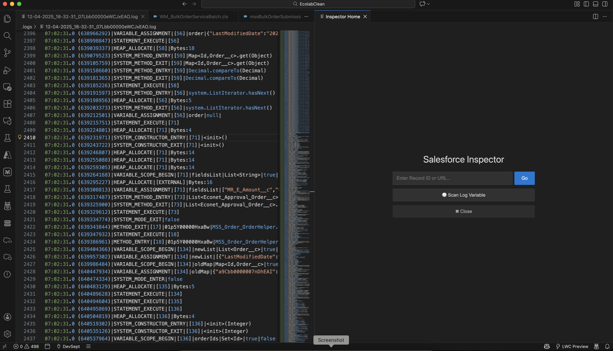
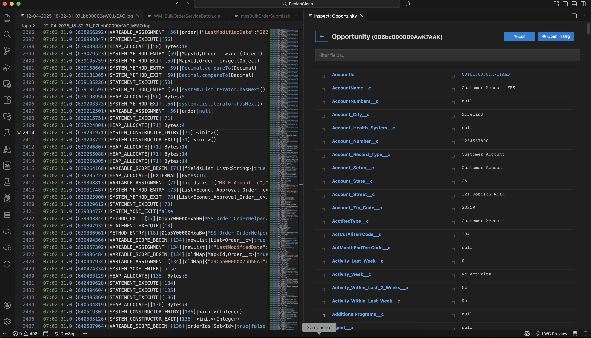
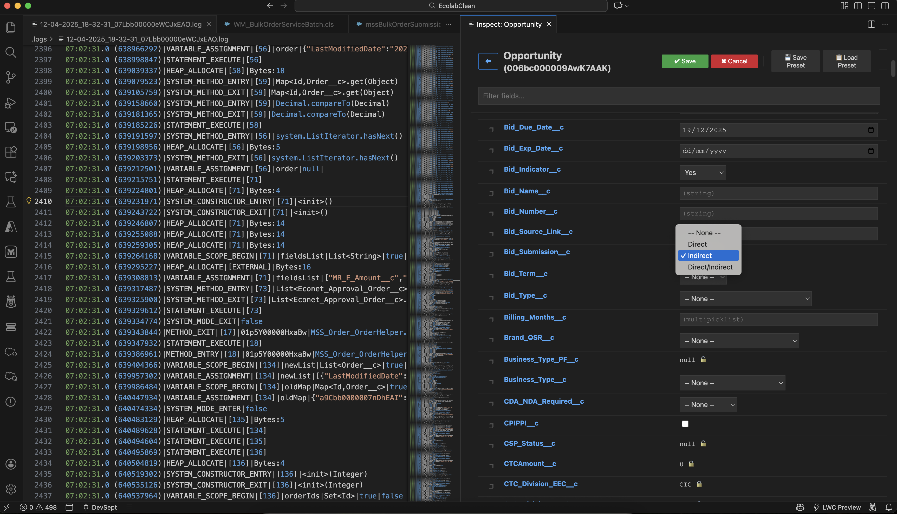

Salesforce Record Inspector
Stop Context Switching. Start Inspecting.

Salesforce Record Inspector is the ultimate productivity booster for Salesforce Developers and Admins. It allows you to view, edit, and analyze Salesforce data directly inside VS Code without ever waiting for the browser to load.

Whether you are debugging a complex Apex log, setting up test data, or verifying a record's state, this extension brings your Org data to you instantly.

## Screenshots

### Enter a Record ID\URL on Home Page

### Get Details of your Salesforce Record

### Edit and Save any Fields on the Record

🚀 Key Features

1. 🔍 Instant Record Inspection

View any Salesforce record instantly without leaving your code.
Smart Detection: Highlight an ID (001...) in any file and right-click "Salesforce Record Inspector".
Clipboard Support: Don't have an ID selected? The extension automatically checks your clipboard for IDs or Salesforce URLs.
Manual Entry: Opens a dedicated Home Screen to paste IDs or URLs manually.

2. ✏️ Smart Data Editor

Update records safely and quickly.
Type-Aware Inputs:
Picklists: Renders actual dropdown menus from your Org.
Dates: Shows a calendar picker.
Booleans: Shows checkboxes.
Read-Only: System fields are locked 🔒 automatically.
Production Safety: Includes a built-in safety interlock. If you try to save changes to a Production org, the extension forces a confirmation dialog to prevent accidents.

3. 💾 Data Presets (Templates)

Stop manually typing the same test data over and over.
Save Preset: After filling out a form, you can save the state as a named Preset (e.g., "Standard Test Account").
Flexible Saving: Choose to save a Snapshot (all visible fields) or just the Modified Fields (delta).
Load Preset: Open a new record, click Load Preset, and watch the form fill itself instantly.

4. ⏳ Log Time Travel (Variable History)

Debugging complex logic? Stop scrolling through thousands of lines of text.
Variable Scanning: Open a .log file, click "Scan Log Variable History", and type a variable name (e.g., myOrderList).
Version History: The panel shows a dropdown of every time that variable was assigned or modified (e.g., Version 1 (Line 50), Version 2 (Line 105)).
Diff Highlighting: Values that changed between versions are highlighted in Yellow so you can spot state mutations instantly.
Noise Filter: Use the "Ignore Nulls" checkbox to hide versions where the variable was null, giving you a clean view of the data's lifecycle.

5. 🧭 Deep Navigation

Drill Down: Click on any related Record ID (e.g., OwnerId, AccountId) in the table to inspect that child/parent record immediately.
History Stack: Use the ⬅ Back button to navigate through your inspection history without losing context.

📖 How to Use

Inspecting a Record
Right-click anywhere in the editor (or on a selected ID) and choose Salesforce Record Inspector.
If an ID is detected (selection or clipboard), the panel loads immediately.
If no ID is found, the Home Screen appears. Paste your ID and hit Enter.

Editing Data
In the Inspector Panel, click the blue ✎ Edit button.
Modify the fields (using dropdowns, checkboxes, etc.).
Click ✔ Save.

(Optional) Click 💾 Save Preset to store these values for later use on other records.

Analyzing Logs
Open a Salesforce Debug Log (.log) file.
Right-click and select Salesforce Record Inspector (or click the Scan Log Variable button on the Home Screen).
Enter the variable name you want to trace.
Use the History Dropdown at the top of the panel to step through the variable's lifecycle.

⚙️ Requirements
VS Code: Version 1.80.0 or higher.
Salesforce CLI: You must have the standard Salesforce CLI installed (sf v2).
Authorized Org: You must be logged into a Salesforce Org in your terminal. The extension automatically connects to your default target org (sf config get target-org).

❓ FAQ

Q: Does this send my data to the cloud?
A: No. This extension runs entirely locally on your machine. It uses your local Salesforce CLI (sf) to fetch data directly from your connected Org. No data is sent to third-party servers.

Q: Can I edit Formula fields?
A: No. The extension detects read-only fields (Formulas, Roll-up Summaries, System Fields) and marks them with a 🔒 icon.

Q: Why isn't my log variable showing up?
**A: Ensure you typed the variable name exactly as it appears in the log. The parser looks for VARIABLE_ASSIGNMENT events.

📄 License
This extension is licensed under the MIT License.